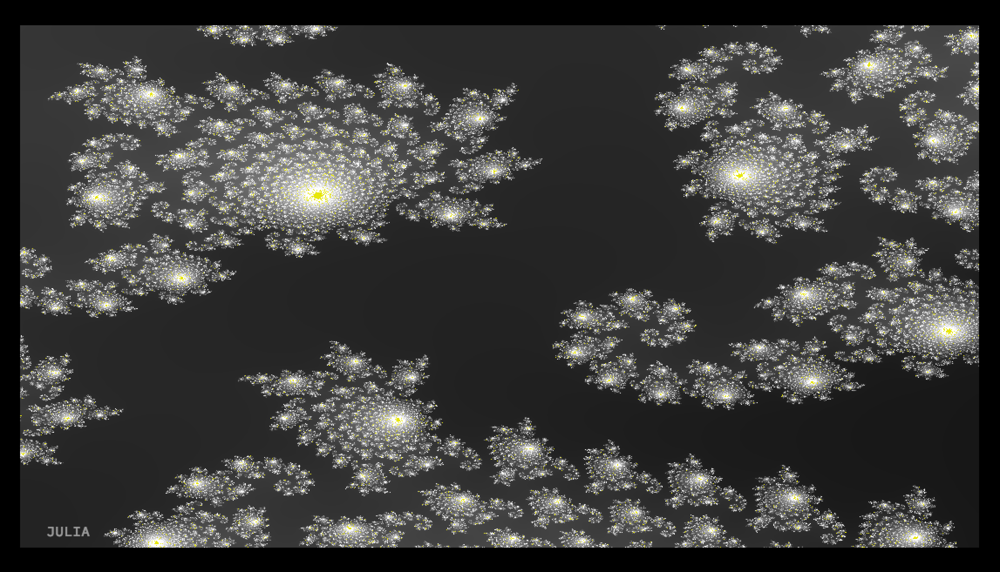

# fractal_explorer
FEATURES:
- pure C
- multithreading
- zooming with mouse infinitely to a particular point
- changing fractal depth(iterations)
- moving with arrows
- choosing fractal type at runtime
- changing color mode at runtime
- changing a complex number seed for Julia at runtime
- bonus fractal from the author: the cat.

USAGE: (TESTED ON MACOS HIGH SIERRA 10.13)
./fractal [ 1 | 2 | 3 | 4 | 5 | 6 ]
- move with the arrows
- dive in with the mouse
- change color with 1
- change fractal with 2
- change depth with +/-
- change Julia's seed with TAB(on/off) + mouse position

